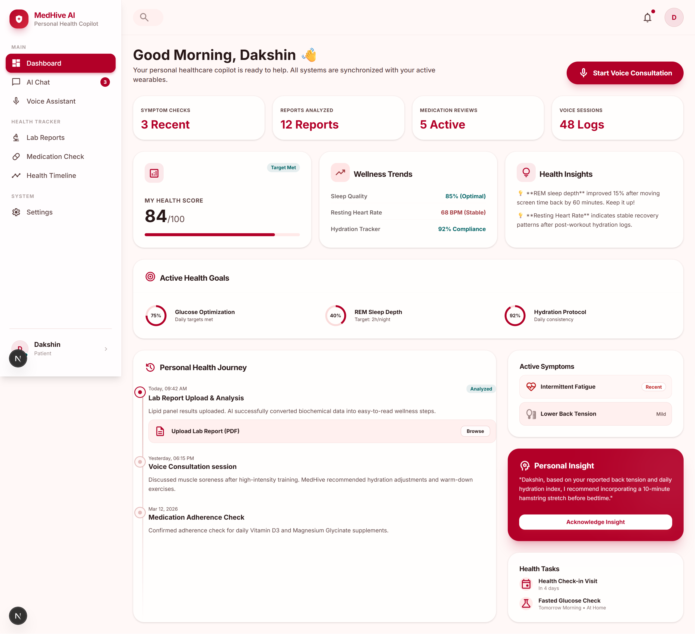
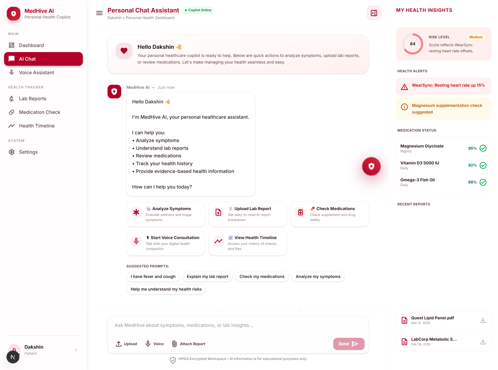
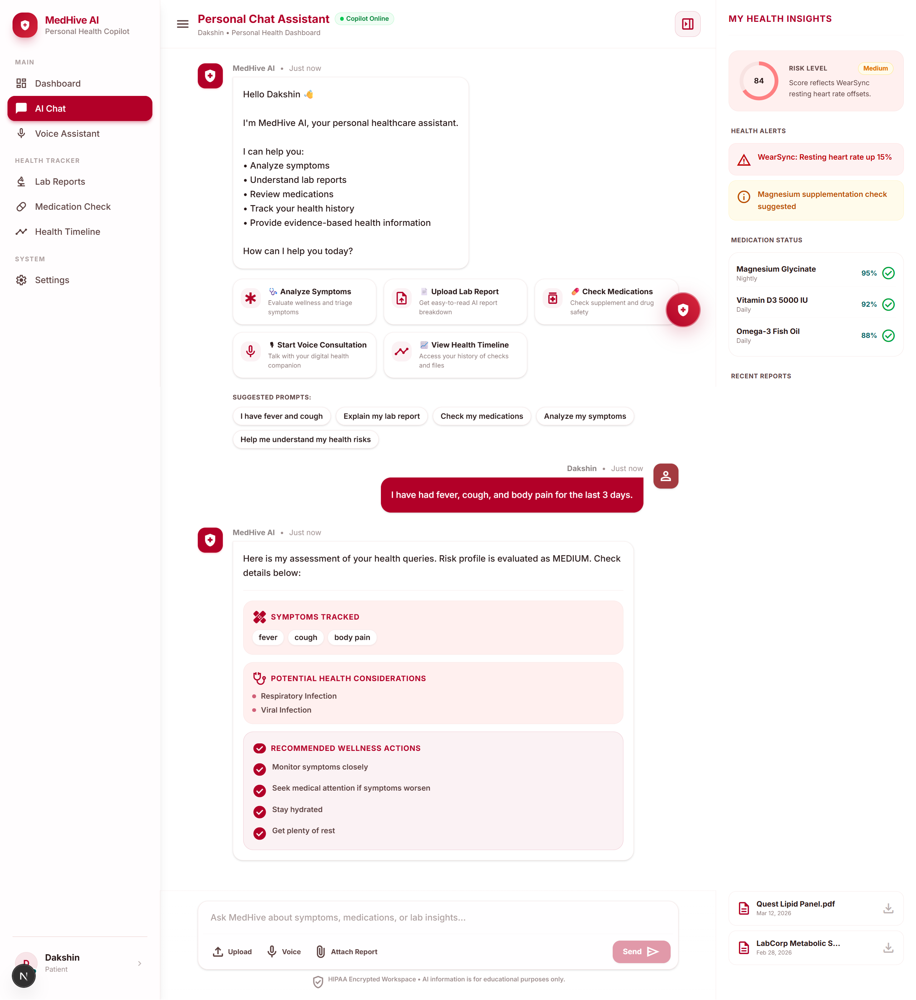
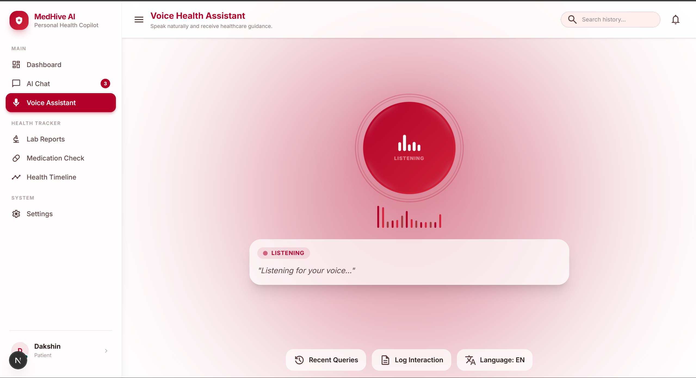
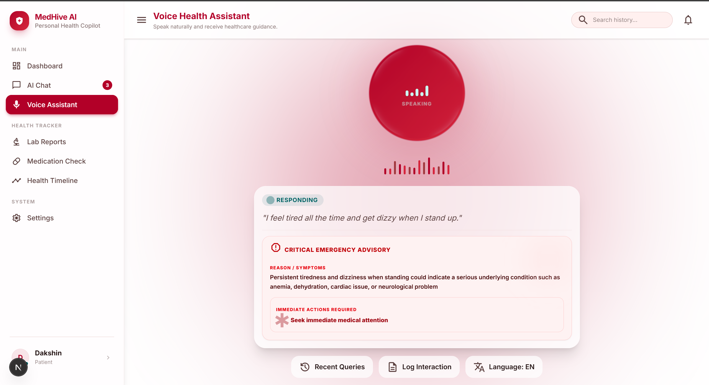
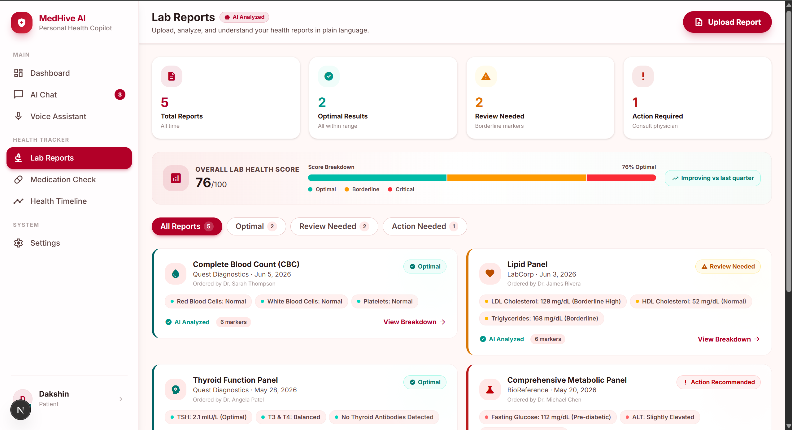
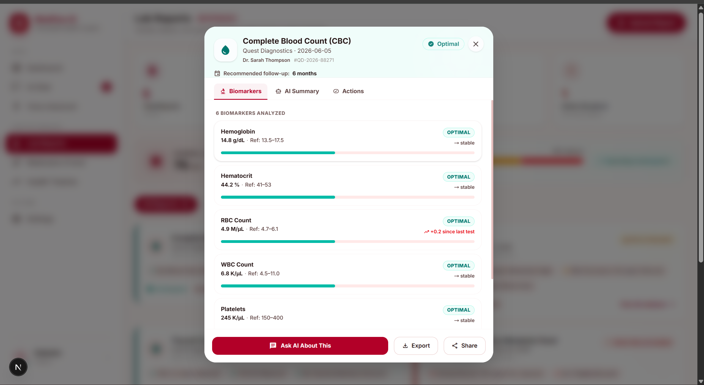
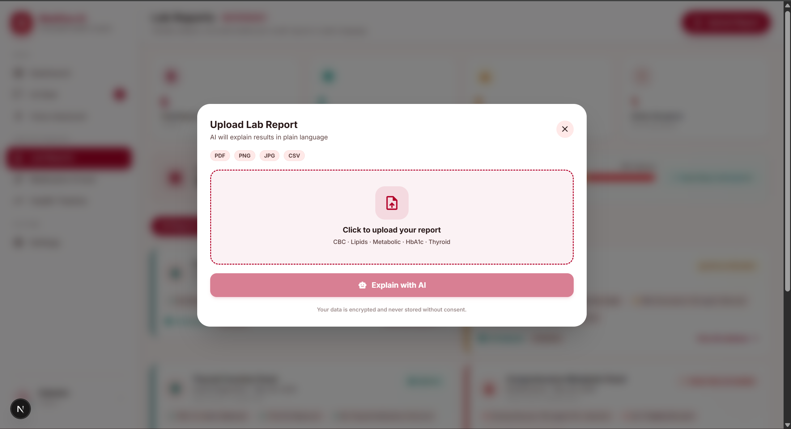
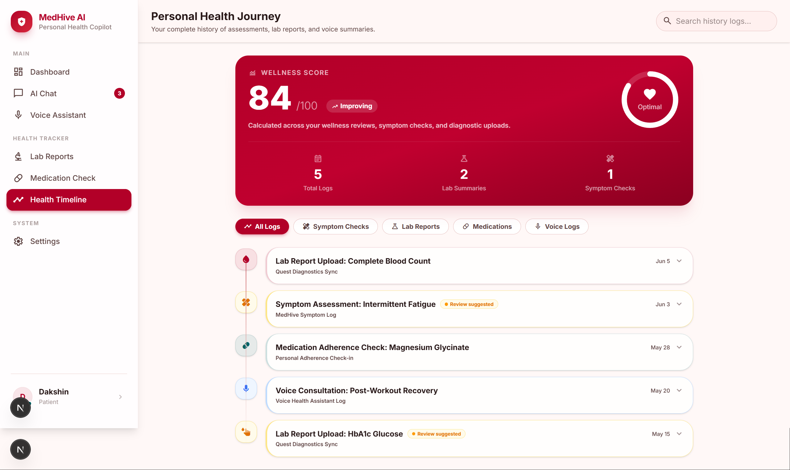
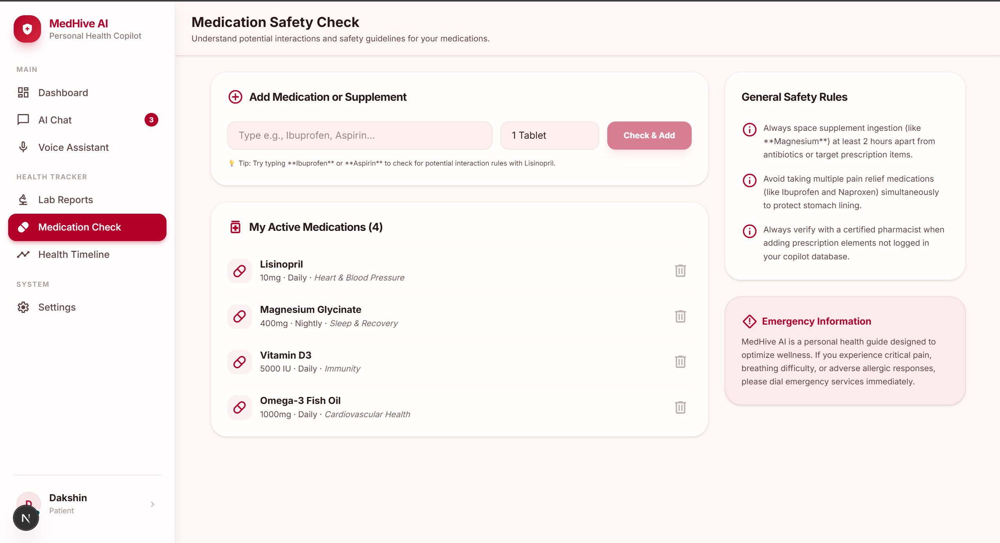

<](https://fastapi.tiangolo.com/)
[](https://nextjs.org/)
[](https://groq.com/)
[](https://ag2.ai/)
[](https://www.trychroma.com/)
[](LICENSE)
[](https://python.org/)

<br/>

</div>

---

## 📸 Screenshots

<table>
  <tr>
    <td align="center"><b>🏠 Dashboard</b></td>
    <td align="center"><b>💬 AI Chat Assistant</b></td>
  </tr>
  <tr>
    <td></td>
    <td></td>
  </tr>
  <tr>
    <td align="center"><b>🩺 AI Chat with Assessment Output</b></td>
    <td align="center"><b>🎙️ Voice Health Assistant — Idle</b></td>
  </tr>
  <tr>
    <td></td>
    <td></td>
  </tr>
  <tr>
    <td align="center"><b>🎙️ Voice Assistant — AI Response</b></td>
    <td align="center"><b>🧪 Lab Reports — Overview</b></td>
  </tr>
  <tr>
    <td></td>
    <td></td>
  </tr>
  <tr>
    <td align="center"><b>🧬 Lab Report — Biomarker Detail</b></td>
    <td align="center"><b>📊 Lab Report — AI Analysis</b></td>
  </tr>
  <tr>
    <td></td>
    <td></td>
  </tr>
  <tr>
    <td align="center"><b>🗓️ Health Timeline</b></td>
    <td align="center"><b>💊 Medication Check</b></td>
  </tr>
  <tr>
    <td></td>
    <td></td>
  </tr>
</table>

---

## ✨ What is MedHive AI?

**MedHive AI** is a full-stack, production-grade AI healthcare copilot that combines a **multi-agent orchestration framework** with **retrieval-augmented generation (RAG)**, real-time **voice interaction**, and a premium **Next.js 15 frontend** to deliver a seamless personal health management experience.

Unlike single-model chatbots, MedHive coordinates **10 specialized AI agents** — each expert in a different medical domain — through a **Healthcare Coordinator** that routes queries, aggregates results, and returns structured, verified health assessments.

> ⚠️ **Disclaimer:** MedHive AI is for **educational and informational purposes only**. It is not a substitute for professional medical advice, diagnosis, or treatment. Always consult a qualified healthcare provider.

---

## 🚀 Key Features

| Feature | Description |
|---|---|
| 🧠 **Multi-Agent AI** | 10 specialized agents coordinated by AG2 — each an expert in their domain |
| 🩺 **Symptom Analysis** | Triage, risk scoring, and condition matching with confidence indicators |
| 🚨 **Emergency Detection** | Automatic escalation for critical symptoms with immediate action guidance |
| 🧬 **Lab Report AI** | Upload PDF/image lab reports and get plain-language biomarker explanations |
| 💊 **Drug Interaction Check** | Identifies dangerous medication combinations from your health profile |
| 🔍 **Verified Medical Search** | Real-time web search grounded in trusted medical sources |
| 📚 **RAG Knowledge Base** | ChromaDB vector store with curated medical literature |
| 🎙️ **Voice Health Assistant** | Whisper STT + Groq TTS — speak your symptoms, hear your analysis |
| 👤 **Patient Memory** | SQLite-backed patient profiles with full health history |
| 📊 **Health Timeline** | Visual longitudinal tracking of symptoms, vitals, and reports |
| 📱 **Responsive UI** | Premium Next.js 15 interface with Framer Motion animations |
| 🔒 **Privacy First** | All data stays local — no cloud storage without explicit consent |

---

## 🏗️ Architecture

```
┌─────────────────────────────────────────────────────────────┐
│                     Next.js 15 Frontend                     │
│  Dashboard · Chat · Voice · Lab Reports · Medications ·     │
│  Health Timeline · Patients · Settings                      │
└─────────────────────┬───────────────────────────────────────┘
                      │ HTTP / REST API
┌─────────────────────▼───────────────────────────────────────┐
│                   FastAPI Backend (Python)                  │
│                                                             │
│  ┌─────────────┐  ┌───────────────┐  ┌───────────────────┐  │
│  │  /analyze   │  │/analyze-report│  │/voice/voice-assist│  │
│  │  (Chat AI)  │  │  (Lab PDF)    │  │   (Whisper+TTS)   │  │
│  └──────┬──────┘  └──────┬────────┘  └─────────┬─────────┘  │
│         │                │                     │            │
│  ┌──────▼──────────────────────────────────────▼──────────┐ │
│  │            Healthcare Coordinator (AG2)                │ │
│  │   Routes · Orchestrates · Aggregates · Verifies        │ │
│  └────────────────────────────────────────────────────────│ │
│                           │                               │ │
│  ┌────────────────────────▼─────────────────────────────┐ │ │
│  │                 Agent Pool                           │ │ │
│  │  🧠 Medical    🚨 Emergency    📊 Risk Assessment  │  │ │
│  │  🔍 Web Search 💊 Drug Inter.  🧬 Lab Report       │  │ │
│  │  ✅ Verification 📝 Summary   💪 Coach  🩺 Symptom │ │ │
│  └──────────────────────────────────────────────────────┘ │ │
│                           │                               │ │
│  ┌────────────────────────▼───────────────────────────┐   │ │
│  │              Services & Storage                    │   │ │
│  │  ChromaDB (RAG) · SQLite (Patients) · Groq API     │   │ │
│  └────────────────────────────────────────────────────┘   │ │
└─────────────────────────────────────────────────────────────┘
```

---

## 🤖 Agent Roster

| Agent | Role |
|---|---|
| **MedicalAgent** | Primary symptom triage and medical knowledge base queries |
| **EmergencyAgent** | Detects life-threatening conditions, triggers emergency protocol |
| **RiskAgent** | Calculates composite risk scores (Low / Medium / High / Critical) |
| **SymptomAgent** | Extracts, classifies, and tracks symptom patterns |
| **WebSearchAgent** | Fetches real-time data from trusted medical sources (Mayo Clinic, NIH, etc.) |
| **LabReportAgent** | Parses and explains lab report biomarkers in plain language |
| **DrugInteractionAgent** | Analyzes medication combinations for dangerous interactions |
| **VerificationAgent** | Cross-validates AI output against evidence sources |
| **SummaryAgent** | Synthesizes multi-agent findings into a structured health assessment |
| **CoachAgent** | Provides actionable wellness recommendations and lifestyle guidance |

---

## 🛠️ Tech Stack

### Backend
| Technology | Purpose |
|---|---|
| **FastAPI** | High-performance async REST API |
| **AG2 (AutoGen v2)** | Multi-agent orchestration framework |
| **Groq API** | Ultra-fast LLaMA 3.3 70B inference |
| **ChromaDB** | Vector database for RAG |
| **Whisper** | Speech-to-text transcription |
| **SQLite + SQLAlchemy** | Patient data persistence |
| **LangChain** | Document loading and text splitting |
| **Uvicorn** | ASGI server |

### Frontend
| Technology | Purpose |
|---|---|
| **Next.js 15** | React framework with App Router |
| **TypeScript** | Type-safe development |
| **Tailwind CSS v4** | Utility-first styling |
| **Framer Motion** | Fluid animations and transitions |
| **Material Symbols** | Google's icon system |
| **Inter** | Premium typography |

---

## 📁 Project Structure

```
medhive-ai/
├── backend/
│   ├── agents/                  # 10 specialized AI agents
│   │   ├── medical_agent.py
│   │   ├── emergency_agent.py
│   │   ├── risk_agent.py
│   │   ├── symptom_agent.py
│   │   ├── web_search_agent.py
│   │   ├── lab_report_agent.py
│   │   ├── drug_interaction_agent.py
│   │   ├── verification_agent.py
│   │   ├── summary_agent.py
│   │   └── coach_agent.py
│   ├── workflows/
│   │   └── healthcare_coordinator.py   # Agent orchestration
│   ├── api/
│   │   ├── routes.py                   # /analyze endpoint
│   │   ├── report_routes.py            # /analyze-report
│   │   └── patient_routes.py           # /patients CRUD
│   ├── voice/
│   │   ├── voice_routes.py             # /voice/voice-assistant
│   │   ├── stt.py                      # Whisper STT
│   │   ├── tts.py                      # Text-to-Speech
│   │   └── whisperflow_service.py
│   ├── rag/
│   │   ├── ingestion.py                # Document ingestion
│   │   └── retriever.py                # Vector search
│   ├── services/
│   │   ├── lab_report_service.py
│   │   └── report_parser.py
│   ├── models/                         # SQLAlchemy ORM models
│   ├── schemas/                        # Pydantic request/response schemas
│   ├── repositories/                   # Database access layer
│   ├── config/settings.py              # App configuration
│   ├── db/init_db.py                   # Database initialization
│   ├── data/medical_docs/              # Medical knowledge base
│   ├── chroma_db/                      # ChromaDB vector store
│   ├── outputs/                        # Generated TTS audio files
│   ├── uploads/                        # Uploaded lab reports
│   ├── main.py                         # FastAPI app entry point
│   └── .env.example
│
├── frontend/
│   └── src/
│       ├── app/
│       │   ├── dashboard/              # Health dashboard
│       │   ├── chat/                   # AI chat interface
│       │   ├── voice/                  # Voice assistant
│       │   ├── lab-reports/            # Lab report analyzer
│       │   ├── medications/            # Drug interaction checker
│       │   ├── health-timeline/        # Health history
│       │   ├── patients/               # Patient management
│       │   └── settings/               # App settings
│       └── components/
│           ├── Sidebar.tsx             # Navigation sidebar
│           └── ui/                     # Reusable UI components
│
├── img/                                # Screenshots
└── README.md
```

---

## ⚡ Quick Start

### Prerequisites

- Python **3.11+**
- Node.js **18+**
- A free **[Groq API key](https://console.groq.com/)**

### 1. Clone the Repository

```bash
git clone https://github.com/Dakshin10/medhive-ai.git
cd medhive-ai
```

### 2. Backend Setup

```bash
cd backend

# Create and activate virtual environment
python -m venv .venv
.venv\Scripts\activate          # Windows
# source .venv/bin/activate     # macOS/Linux

# Install dependencies
pip install -r requirements.txt

# Configure environment
copy .env.example .env          # Windows
# cp .env.example .env          # macOS/Linux

# Edit .env and add your Groq API key
# GROQ_API_KEY=your_key_here
# MODEL_NAME=llama-3.3-70b-versatile

# Initialize the database
python -c "from db.init_db import init_db; init_db()"

# Start the backend server
uvicorn main:app --reload
```

The API will be running at **`http://localhost:8000`**
Interactive API docs: **`http://localhost:8000/docs`**

### 3. Frontend Setup

```bash
cd frontend

# Install dependencies
npm install

# Start the development server
npm run dev
```

The frontend will be running at **`http://localhost:3000`**

---

## 🔑 Environment Variables

Create `backend/.env` from the example:

```env
# Required
GROQ_API_KEY=your_groq_api_key_here

# Model Selection (default: llama-3.3-70b-versatile)
MODEL_NAME=llama-3.3-70b-versatile
```

Get your free Groq API key at **[console.groq.com](https://console.groq.com/)** — inference is blazing fast (700+ tokens/sec) and free to start.

---

## 🌐 API Endpoints

| Method | Endpoint | Description |
|---|---|---|
| `POST` | `/analyze` | Main health query — routes through all agents |
| `POST` | `/analyze-report` | Upload & analyze lab report PDF |
| `POST` | `/voice/voice-assistant` | Voice query: audio in → transcript + AI response + audio out |
| `GET` | `/patients` | List all patients |
| `POST` | `/patients` | Create patient profile |
| `GET` | `/patients/{id}` | Get patient details |
| `PUT` | `/patients/{id}` | Update patient record |
| `DELETE` | `/patients/{id}` | Delete patient |
| `GET` | `/health` | API health check |
| `GET` | `/docs` | Interactive Swagger UI |

---

## 🧪 Sample API Usage

### Symptom Analysis
```bash
curl -X POST http://localhost:8000/analyze \
  -H "Content-Type: application/json" \
  -d '{"message": "I have been having chest tightness, shortness of breath, and fatigue for 3 days"}'
```

**Response:**
```json
{
  "status": "SUCCESS",
  "assessment": {
    "symptoms": ["chest tightness", "shortness of breath", "fatigue"],
    "risk_level": "HIGH",
    "possible_conditions": ["Cardiac event", "Pulmonary embolism", "Severe anemia"],
    "recommendations": ["Seek immediate medical attention", "Avoid strenuous activity"],
    "confidence_score": 87,
    "evidence_sources": ["https://www.mayoclinic.org/..."]
  }
}
```

### Lab Report Upload
```bash
curl -X POST http://localhost:8000/analyze-report \
  -F "file=@CBC_report.pdf"
```

---

## 🎙️ Voice Assistant Flow

```
User speaks → Whisper STT → Text transcript
     ↓
Healthcare Coordinator (10 agents)
     ↓
Structured JSON assessment
     ↓
Groq TTS → Audio response file
     ↓
Frontend plays audio + displays rich assessment card
```

---

## 🏥 Supported Medical Domains

- **Cardiology** — Heart rate, blood pressure, cardiac symptoms
- **Endocrinology** — Diabetes (HbA1c, glucose), thyroid function
- **Hematology** — CBC, hemoglobin, platelets, anemia indicators
- **Lipidology** — LDL, HDL, triglycerides, cardiovascular risk
- **Hepatology** — Liver enzymes (ALT, AST), metabolic panel
- **Nephrology** — Kidney function (creatinine, BUN, GFR)
- **Pulmonology** — Respiratory symptoms, oxygen saturation
- **Pharmacology** — Drug-drug interactions, supplement safety
- **Emergency Medicine** — Triage and critical condition detection
- **Preventive Medicine** — Wellness coaching and lifestyle optimization

---

## 🔒 Privacy & Security

- ✅ All data processed **locally** — nothing sent to external servers except LLM inference
- ✅ No patient data stored in the cloud
- ✅ `.env` secrets are never committed to version control
- ✅ CORS configured for local development
- ✅ SQLite database stays on your machine
- ⚠️ For production use, add authentication, HTTPS, and proper secrets management

---

## 🛣️ Roadmap

- [ ] 🔐 User authentication (JWT / OAuth2)
- [ ] 🌍 Multi-language support (Hindi, Spanish, French)
- [ ] 📱 React Native mobile app
- [ ] 🩺 FHIR / HL7 integration for EHR import
- [ ] 📈 Advanced analytics dashboard with charts
- [ ] 🔔 Push notification for medication reminders
- [ ] 🤝 Doctor-patient secure messaging
- [ ] 🧬 Genomics data integration
- [ ] ☁️ Optional cloud sync with end-to-end encryption

---

## 🤝 Contributing

Contributions are welcome! Here's how to get started:

```bash
# Fork the repo and clone it
git clone https://github.com/your-username/medhive-ai.git

# Create a feature branch
git checkout -b feature/your-amazing-feature

# Make your changes, then commit
git commit -m "feat: add amazing feature"

# Push and open a Pull Request
git push origin feature/your-amazing-feature
```

Please follow [Conventional Commits](https://www.conventionalcommits.org/) and ensure all new agents include proper error handling.

---

## 📄 License

This project is licensed under the **MIT License** — see the [LICENSE](LICENSE) file for details.

---

## 🙏 Acknowledgements

| Tool | Purpose |
|---|---|
| [AG2 (AutoGen)](https://ag2.ai/) | Multi-agent orchestration |
| [Groq](https://groq.com/) | Ultra-fast LLM inference |
| [Meta LLaMA 3.3](https://llama.meta.com/) | Foundation language model |
| [OpenAI Whisper](https://openai.com/research/whisper) | Speech recognition |
| [ChromaDB](https://www.trychroma.com/) | Vector database |
| [FastAPI](https://fastapi.tiangolo.com/) | Python web framework |
| [Next.js](https://nextjs.org/) | React meta-framework |
| [Framer Motion](https://www.framer.com/motion/) | UI animations |

---

<div align="center">

**Built with ❤️ by [Dakshin](https://github.com/Dakshin10)**

<br/>


&nbsp;


<br/><br/>

*If this project helped you, please ⭐ star the repository!*

</div>
]]>
